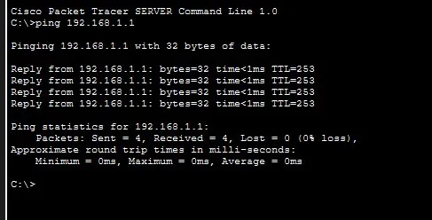

# Challenge Packet Tracer — Routage Statique

**Auteur :** Zinedine Balamane | **GitHub :** Zb95-IT | **Formation :** TSSR Wild Code School

---

## Topologie

4 réseaux, 3 routeurs, 1 PC, 1 serveur interconnectés en ligne.

---

## Plan d'adressage

| Équipement | Interface | Adresse IP | Masque | Passerelle |
|---|---|---|---|---|
| PC0 | NIC | 192.168.1.10 | 255.255.255.0 | 192.168.1.1 |
| R1 | Gig0/0 | 192.168.1.1 | 255.255.255.0 | — |
| R1 | Gig0/1 | 192.168.2.1 | 255.255.255.0 | — |
| R2 | Gig0/0 | 192.168.2.2 | 255.255.255.0 | — |
| R2 | Gig0/1 | 192.168.3.1 | 255.255.255.0 | — |
| R3 | Gig0/0 | 192.168.3.2 | 255.255.255.0 | — |
| R3 | Gig0/1 | 192.168.4.1 | 255.255.255.0 | — |
| Server0 | NIC | 192.168.4.10 | 255.255.255.0 | 192.168.4.1 |

---

## Tables de routage

### R1 — Route par défaut

.webp>)

R1 est en bout de chaîne. Une route par défaut `S* 0.0.0.0/0` via `192.168.2.2` envoie tout le trafic inconnu vers R2.

---

### R2 — Routes spécifiques

.webp>)

R2 est le routeur central. Il dispose de deux routes spécifiques : `192.168.1.0/24` via R1 et `192.168.4.0/24` via R3.

---

### R3 — Route par défaut

.webp>)

R3 est en bout de chaîne. Une route par défaut `S* 0.0.0.0/0` via `192.168.3.1` envoie tout le trafic inconnu vers R2.

---

## Tests de connectivité

### Ping PC0 vers Server0

.webp>)

0% de perte. Le paquet traverse R1 → R2 → R3. Routage opérationnel.

---

### Ping Server0 vers PC0

.webp>)

0% de perte. Chemin retour R3 → R2 → R1 fonctionnel. Routage bidirectionnel confirmé.
